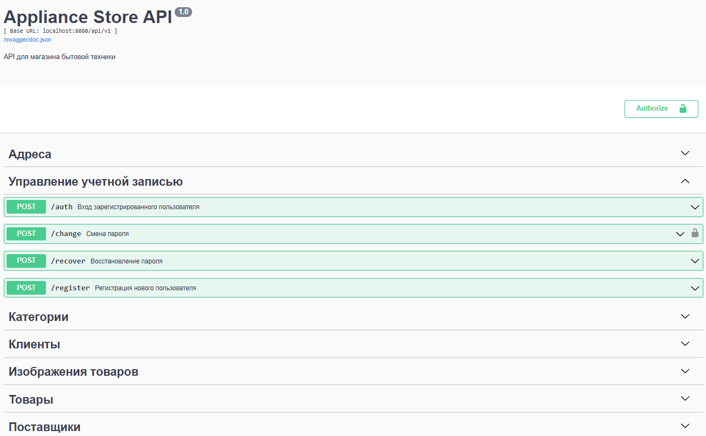

# E-Commerce Platform (Microservices)

Микросервисная платформа для управления интернет-магазином бытовой техники с отдельным сервисом авторизации.

# 📋 Содержание

- [Архитектура](#архитектура)
- [Технологии](#технологии)
- [Быстрый старт](#быстрый-старт-docker)
- [Ручной запуск](#ручной-запуск-без-docker)
- [API Endpoints](#api-endpoints)

---

# Архитектура

Проект построен по **микросервисной архитектуре** с разделением на два независимых сервиса:

## 1. Store Service (HTTP)
- **Порт**: `8080`
- **База данных**: PostgreSQL (shop-db)
- **Функционал**:
  - [CRUD операции](#api-endpoints) для товаров, категорий, клиентов, поставщиков
  - Swagger/OpenAPI документация

## 2. Auth Service (gRPC)
- **Порт**: `50051`
- **База данных**: PostgreSQL (auth-db) — изолированная
- **Функционал**:
  - Регистрация пользователей (bcrypt хэширование паролей)
  - JWT-аутентификация
  - Валидация JWT-токенов через gRPC
  - Смена пароля
  - Восстановление пароля

---

# Технологии

- **Go**
- **HTTP Router (chi)**
- **gRPC**
- **SQLC**
- **PostgreSQL**
- **JWT** 
- **Bcrypt** 
- **DI (UBER/FX)**
- **Docker & Docker Compose**

---

# Быстрый старт (Docker)

### 1. Клонировать репозиторий
`git clone https://github.com/neoceann/e-commerce-platform.git`

`cd e-commerce-platform`

### 2. Собрать и запустить всё через Docker Compose

`make docker-build`

`make docker-up`

### 3. Проверить что всё работает
`curl http://localhost:8080/health`

### 4. Открыть Swagger UI
`http://localhost:8080/swagger/index.html`

* Примечание: Все сгенерированные файлы (protobuf, sqlc, swagger) уже включены в репозиторий.

---

# Ручной запуск (без Docker)

## Требования

- **Go**
- **PostgreSQL**
- **protoc** (опционально, для перегенерации)
- **sqlc** (опционально, для перегенерации)
- **swag** (опционально, для перегенерации)

## Шаги

### 1. Клонировать репозиторий
`git clone https://github.com/neoceann/e-commerce-platform.git`

`cd e-commerce-platform`

### 2. Создать базы данных 

`CREATE DATABASE store;`

`CREATE DATABASE auth;`

### 3. Заполнить .env в директориях `store` и `auth-service`

`cp store/.env.example store/.env`

`cp auth-service/.env.example auth-service/.env`

### 4. Отредактировать .env файлы под своё окружение

### 5. Накатить миграции

`migrate -path ./migrations -database "postgresql://DB_USER:DB_PASSWORD@DB_HOST:DB_PORT/DB_NAME?sslmode=DB_SSL_MODE" up`

* В оба сервиса. По данным, забитым в .env

### 5. Запустить сервисы в разных терминалах

* Терминал 1 — Auth Service

`cd auth-service && go run cmd/auth/main.go`

* Терминал 2 — Store API

`cd store && go run cmd/api/main.go`

### 6. Открыть Swagger UI
`http://localhost:8080/swagger/index.html`

* Примечание: Все сгенерированные файлы (protobuf, sqlc, swagger) уже включены в репозиторий.

---

# API Endpoints

## Публичные эндпоинты (без токена)

Здесь приведено описание функционала. Подробная Swagger-документация доступна по пути:

`http://localhost:8080/swagger/index.html`

- Регистрация нового пользователя
- Аутентификация
- Восстановление пароля (вывод нового пароля в лог)

## Защищённые эндпоинты (требуется авторизоваться с помощью полученного JWT-токена)

- Смена пароля

### Для клиентов:

- Добавление клиента

- Удаление клиента

- Получение клиентов по имени и фамилии

- Получение всех клиентов (опциональные параметры пагинации: limit и offset. В случае отсутствия этих параметров возвращается весь список)

- Изменение адреса клиента

### Для товаров:

- Добавление товара

- Уменьшение количества товара

- Получение товара по id

- Получение всех доступных товаров

- Удаление товара по id

### Для поставщиков:

- Добавление поставщика

- Изменение адреса поставщика

- Удаление поставщика по id

- Получение всех поставщиков

- Получение поставщика по id

### Для изображений:

- добавление изображения

- Изменение изображения

- Удаление изображения по id изображения

- Получение изображения конкретного товара

- Получение изображения по id изображения
